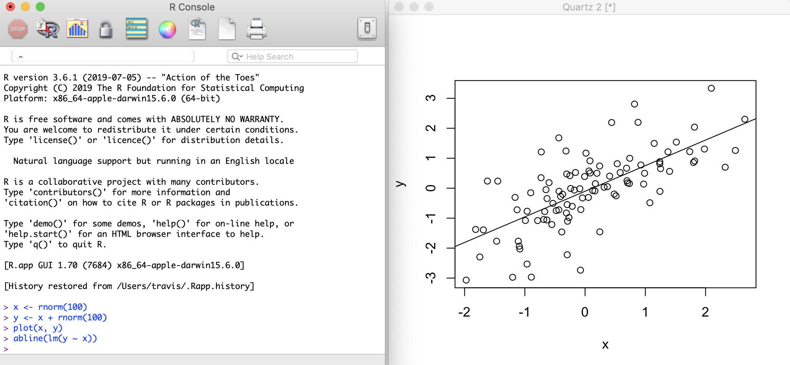
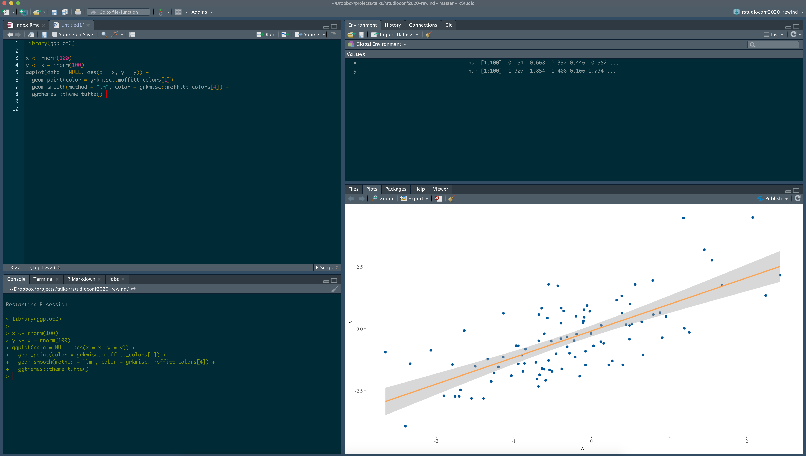

```{r setup, include=FALSE}
options(htmltools.dir.version = FALSE)

knitr::opts_chunk$set(
  fig.width = 10, fig.height = 6, fig.retina = 2,
  warning = FALSE, message = FALSE
)
```

class: center middle hide-count hide-logo
background-image: url(figures/2020-audience2.jpg)
background-size: 100%
background-position: center

<div class="talk-logo swivel-horizontal"></div>

.talk-title[
.talk-title-main.moffitt-blue[:::a rewind for academic newcomers:::]
]

.talk-meta[
  .talk-author[Travis Gerke, ScD]
  
  <!-- https://fontawesome.com/license -->
  .talk-date[ @travisgerke]
]

---
### What is R?

A programming language and free software for statistical computing and graphics 
* The R community drives its greatest superpower: user-submitted packages
* Looks like below (&#x1F62C; &#x1F605;)

.top-right-r[

]

.h-center.w-70[

]

---
### What is RStudio?

An integrated development environment (IDE) for R
* Most often appears as a desktop application like below (&#x1F485;)
* Can also run in a browser via RStudio Server

.top-right-rstudio[

]

.h-center.w-65[

]

---

```{css, echo=FALSE}
@import url('https://fonts.googleapis.com/css?family=Merriweather:300');

.talk-logo {
  width: 1000px;
  height: 200px;
  position: absolute;
  top: 25%;
  left: calc(50% - 500px);
  background-image: url('figures/2020-logo-with-shadow.png');
  background-size: cover;
  background-repeat: no-repeat;
}
.talk-title {
  font-family: Overpass;
}
.talk-title .talk-title-main {
  font-family: 'Merriweather', serif;
  font-size: 1em;
  font-weight: bold;
  position: absolute;
  bottom: 5%;
  right: 0%;
  width: 50%;
}
.talk-title .talk-title-sub {
  font-size: 1.28em;
  position: absolute;
  top: 66%;
  width: 100%;
  left: 0;
}
.talk-meta {
  font-family: Overpass;
  position: absolute;
  text-align: left;
  bottom: 25px;
  left: 35px;
}
.talk-meta p {
	margin-top: 0.25em;
	margin-bottom: 0.25em;
}
.talk-title {
  margin-bottom: 5em;
  text-align: center;
}
.talk-author {
  color: #444;
  font-weight: bold;
  font-size: 1.5em;
  line-height: 1em;
  margin-bottom: 0;
}
.talk-date {
  color: #666;
  font-size: 1.25em;
  line-height: 0;
  margin-top: 0;
}

.hide-count .remark-slide-number {
  display: none;
}

@keyframes swivel-horizontal {
  0% {
    transform: rotateY(0);
  }
  50% {
    transform: rotateY(360deg);
  }
  100% {
    transform: rotateY(360deg);
  }
}

.remark-visible .swivel-horizontal {
  animation-name: swivel-horizontal;
  animation-duration: 5s;
  animation-timing-function: linear;
  animation-iteration-count: infinite;
}

.moffitt-orange { color: #faa555; }

.w-15 {
  width: 15%;
}
.w-25 {
  width: 25%;
}
.w-50 {
  width: 50%;
}
.w-65 {
  width: 65%;
}
.w-70 {
  width: 70%;
}
.w-85 {
  width: 85%;
}
.h-center {
  margin: 0 auto;
}
.v-center {
  display: flex;
  justify-content: center;
  align-items: center;
}

.top-right-r {
  position: absolute;
  top: 0%;
  width: 8%;
  right: 3%;
}
.top-right-rstudio {
  position: absolute;
  top: 0%;
  width: 15%;
  right: 3%;
}

```

