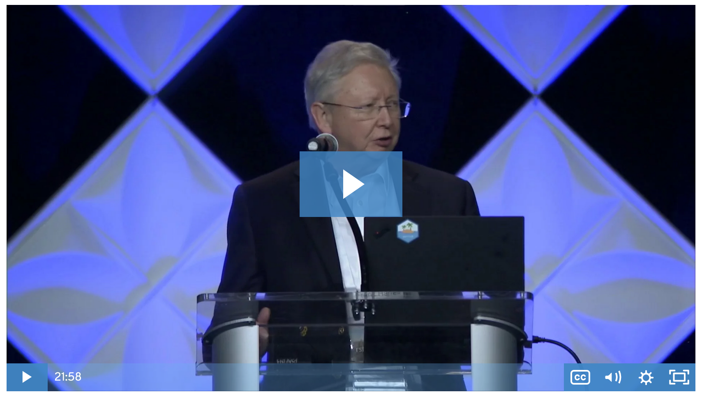

```{r setup, include=FALSE}
options(htmltools.dir.version = FALSE)

knitr::opts_chunk$set(
  fig.width = 10, fig.height = 6, fig.retina = 2,
  warning = FALSE, message = FALSE
)

xaringanExtra::use_xaringan_extra(c("animate_css"))
```

class: center middle hide-count hide-logo
background-image: url(figures/2020-audience2.jpg)
background-size: 100%
background-position: center

<div class="talk-logo swivel-horizontal"></div>

.talk-title[
.talk-title-main.moffitt-blue[:::a rewind for academic newcomers:::]
]

.talk-meta[
  .talk-author[Travis Gerke, ScD]
  
  <!-- https://fontawesome.com/license -->
  .talk-date[ @travisgerke]
]

---
### What is R?

A programming language and free software for statistical computing and graphics 
* The R community drives its greatest superpower: user-submitted packages
* Looks like below (&#x1F62C; &#x1F605;)

.top-right-r[

]

.h-center.w-70[

]

---
### What is RStudio?

An integrated development environment (IDE) for R
* Most often appears as a desktop application like below (&#x1F485;)
* Can also run in a browser via RStudio Server

.top-right-rstudio[

]

.h-center.w-65[

]

---
### rstudio::conf

The most useful/inspirational annual conference I attend
* Begins with 2-day workshops (below + [link](https://github.com/rstudio-conf-2020)), followed by 2-day conference
.h-center.w-45[

]

---
layout: true
class: talks animated fadeIn

### rstudio::conf talks

Generally organized into tracks, which include:
* Learning/using R
* Professional/organizational thinking
* Community
* Pharma/medicine
* Programming
* Education
* Communication (.one[R Markdown] + .three[Shiny])
* .two[Visualization]

---
class: full 

---
.h-right-decide[

]

---
class: talks-one

---
class: talks-two

---
class: talks-three

---
layout: false

### ALL THE TALKS ARE FREELY AVAILABLE &#x1F92F;

Here: [https://resources.rstudio.com/rstudio-conf-2020](https://resources.rstudio.com/rstudio-conf-2020)

.h-center.w-85[

]

---
class: inverse 

<br><br><br>
.h-center.w-25[

]

.center[makes high quality reports that can be shared with an audience
<br>
(which may include code)]

---
### One R Markdown Document, Fourteen Demos <br> .small.moffitt-green[*Yihui Xie*] <br> .smaller[&#x1F4FA; [Key times (2:10, 7:45, 8:45, 9:45, 15:50, 17:00, 21:00)](https://yihui.org/en/2020/02/rstudio-conf-2020/)]

[.h-center.w-65[

]](https://resources.rstudio.com/rstudio-conf-2020/one-r-markdown-document-fourteen-demosyihui-xie)

---
### How Rmarkdown changed my life <br> .small.moffitt-green[*Rob Hyndman*] <br> .smaller[&#x1F4FA; [Slides (best viewed with rapid scroll, materials also at this site)](https://robjhyndman.com/seminars/rmarkdown/)]

[.h-center.w-65[

]](https://resources.rstudio.com/rstudio-conf-2020/how-rmarkdown-changed-my-life-rob-hyndman)

---
### R for Graphical Clinical Trial Reporting <br> .small.moffitt-green[*Frank Harrell*] <br> .smaller[&#x1F4FA; [Key slide (the links on 16)](http://hbiostat.org/talks/rstudio20.html#16)]

[.h-center.w-65[

]](https://resources.rstudio.com/rstudio-conf-2020/r-for-graphical-clinical-trial-reporting-frank-harrell)

---
### Don’t repeat yourself, talk to yourself! <br> .small[Repeated reporting in the R universe] <br> .small.moffitt-green[*Sharla Gelfand*] <br> .smaller[&#x1F4FA; [Key slides (3-5, 20-21, 43, 47)](https://sharstudioconf.netlify.com/#1)]

[.h-center.w-65[

]](https://resources.rstudio.com/rstudio-conf-2020/dont-repeat-yourself-talk-to-yourself-repeated-reporting-in-the-r-universe-sharla-gelfand)

---
class: inverse 

<br><br><br><br><br><br><br>

.center[data visualization]

---
### The Glamour of Graphics <br> .small.moffitt-green[*William Chase*] <br> .smaller[&#x1F4FA; [Key slides (8, 18, 34+)](https://www.williamrchase.com/slides/assets/player/KeynoteDHTMLPlayer.html#0)]

[.h-center.w-65[

]](https://resources.rstudio.com/rstudio-conf-2020/the-glamour-of-graphics-william-chase)

---
### Making better spaghetti (plots) <br> .small[Exploring the individuals in longitudinal data with the brolgar package] <br> .small.moffitt-green[*Dr. Nicholas Tierney*] <br> .smaller[&#x1F4FA; [Key slides (14, 24, 71, 93 )](https://njt-rstudio20.netlify.com/#1)]

[.h-center.w-65[

]](https://resources.rstudio.com/rstudio-conf-2020/making-better-spaghetti-plots-exploring-the-individuals-in-longitudinal-data-with-the-brolgar-pac-dr-nicholas-tierney)

---
### Effective Visualizations <br> .small.moffitt-green[*Miriah Meyer*] <br> .smaller[&#x1F4FA; [Key timepoint (7:24)](https://resources.rstudio.com/rstudio-conf-2020/effective-visualizations-miriah-meyer)]

[.h-center.w-65[

]](https://resources.rstudio.com/rstudio-conf-2020/effective-visualizations-miriah-meyer)

---
class: inverse 

<br><br><br>
.h-center.w-25[

]

.center[builds interactive web applications
<br>
(permits users to leverage the power of R in a web browser)]

---
### Styling Shiny apps with Sass and Bootstrap 4  <br> .small.moffitt-green[*Joe Cheng*] <br> .smaller[&#x1F4FA; [Talk](https://resources.rstudio.com/rstudio-conf-2020/styling-shiny-apps-with-sass-and-bootstrap-4-joe-cheng)]

[.h-center.w-65[

]](https://resources.rstudio.com/rstudio-conf-2020/styling-shiny-apps-with-sass-and-bootstrap-4-joe-cheng)

---
### Shiny New Things Using R Bridge the Gap in Electronic Medical Record Reporting <br> .small.moffitt-green[*Brendan Graham*] <br> .smaller[&#x1F4FA; [Talk](https://resources.rstudio.com/rstudio-conf-2020/shiny-new-things-using-r-bridge-the-gap-in-electronic-medical-record-reporting-brendan-graham)]

[.h-center.w-65[

]](https://resources.rstudio.com/rstudio-conf-2020/shiny-new-things-using-r-bridge-the-gap-in-electronic-medical-record-reporting-brendan-graham)

---
### rstudio::conf 2021

Is in Orlando: January 18-21!
* [https://rstudio.com/conference/](https://rstudio.com/conference/)  

<br>

.h-center.w-85[

]


<!--
heatmap redesign:
https://resources.rstudio.com/rstudio-conf-2020/effective-visualizations-miriah-meyer


-->

```{css, echo=FALSE}
@import url('https://fonts.googleapis.com/css?family=Merriweather:300');

.talk-logo {
  width: 1000px;
  height: 200px;
  position: absolute;
  top: 25%;
  left: calc(50% - 500px);
  background-image: url('figures/2020-logo-with-shadow.png');
  background-size: cover;
  background-repeat: no-repeat;
}
.talk-title {
  font-family: Overpass;
}
.talk-title .talk-title-main {
  font-family: 'Merriweather', serif;
  font-size: 1em;
  font-weight: bold;
  position: absolute;
  bottom: 5%;
  right: 0%;
  width: 50%;
}
.talk-title .talk-title-sub {
  font-size: 1.28em;
  position: absolute;
  top: 66%;
  width: 100%;
  left: 0;
}
.talk-meta {
  font-family: Overpass;
  position: absolute;
  text-align: left;
  bottom: 25px;
  left: 35px;
}
.talk-meta p {
	margin-top: 0.25em;
	margin-bottom: 0.25em;
}
.talk-title {
  margin-bottom: 5em;
  text-align: center;
}
.talk-author {
  color: #444;
  font-weight: bold;
  font-size: 1.5em;
  line-height: 1em;
  margin-bottom: 0;
}
.talk-date {
  color: #666;
  font-size: 1.25em;
  line-height: 0;
  margin-top: 0;
}

.hide-count .remark-slide-number {
  display: none;
}

@keyframes swivel-horizontal {
  0% {
    transform: rotateY(0);
  }
  50% {
    transform: rotateY(360deg);
  }
  100% {
    transform: rotateY(360deg);
  }
}

.remark-visible .swivel-horizontal {
  animation-name: swivel-horizontal;
  animation-duration: 5s;
  animation-timing-function: linear;
  animation-iteration-count: infinite;
}

.moffitt-orange { color: #faa555; }

.w-15 {
  width: 15%;
}
.w-25 {
  width: 25%;
}
.w-45 {
  width: 45%;
}
.w-50 {
  width: 50%;
}
.w-65 {
  width: 65%;
}
.w-70 {
  width: 70%;
}
.w-85 {
  width: 85%;
}
.h-center {
  margin: 0 auto;
}
.v-center {
  display: flex;
  justify-content: center;
  align-items: center;
}

.top-right-r {
  position: absolute;
  top: 0%;
  width: 8%;
  right: 3%;
}
.top-right-rstudio {
  position: absolute;
  top: 0%;
  width: 15%;
  right: 3%;
}
.h-right-decide {
  position: absolute;
  top: 20%;
  width: 35%;
  right: 3%;
}

.talks:not(.full) {
  color: #aaa;
}

.talks-one .one,
.talks-two .two,
.talks-three .three {
  color: #eb1455;
}

```

